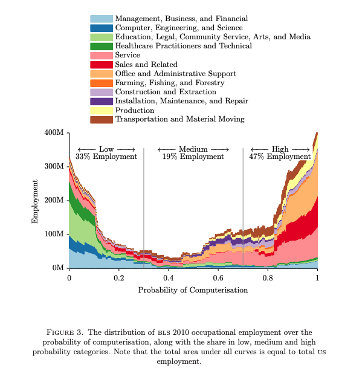
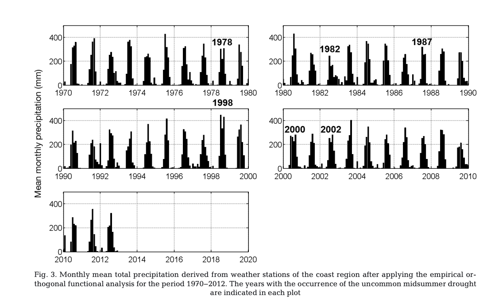

```{r, include = FALSE}
library(mosaic)
library(broom)
library(tidyverse)
library(ggplot2)

options(digits = 6)
```

# Practicing Academic Integrity

If you worked with others or used resources outside of provided course material (anything besides our textbook(s), course materials in Moodle, R help menu) to complete this assignment, please acknowledge them below using a bulleted list. 

<!-- ~~~~~~~~~~~~~~~~ YOU MAY BEGIN EDITING BELOW THIS LINE ~~~~~~~~~~~~~~~~ -->

*I acknowledge the following individuals with whom I worked on this assignment:*

Name(s) and corresponding problem(s)

*

*I used the following sources to help complete this assignment:*

Source(s) and corresponding problem(s)

* https://www.rdocumentation.org/packages/broom/versions/0.4.1/topics/augment, CASI 1.1
* https://rdrr.io/cran/mosaic/man/resample.html, CASI 1.4
* https://datascienceplus.com/fitting-polynomial-regression-r/, CASI 1.1
* https://en.wikipedia.org/wiki/Permutation_test, CASI 1.4

\newpage


# PROBLEMS TO TURN IN:  Vis 1, Vis 2, CASI 1.1, CASI 1.4, Portfolio Reflection 

## Visualization Problems (Adapted from an assignment by Prof. Horton)


## Vis 1 - Compelling

{#id .class width=50% height=50%}


Frey, Carl Benedikt, and Michael Osborne. "The future of employment." (2013). Accessed 15 Sep. 2022.
This graphic was found through Google Scholar

I found this graphic to be compelling because right from the start, it pops off of the page with lots of different colors. The graph contains many different components and is interesting to take in. In particular, I found it interesting how the different industries vary with the probability of computerization. Overall, this graphic combines a lot of different perspectives to look at while being visually appealing.


```{r, include = FALSE}
#Be sure to add your commentary!

#And the citation information. 


#Was this from JSTOR or Google Scholar?
```

## Vis 2 - Suboptimal

{#id .class width=50% height=50%}
\newline Vega-Camarena, José Pablo, et al. “Contrasting Rainfall Behavior between the Pacific Coast and the Mexican Altiplano.” Climate Research, vol. 76, no. 3, 2018, pp. 225–40. JSTOR, https://www.jstor.org/stable/26626182. Accessed 15 Sep. 2022.

This graphic was found through JSTOR

I found this graphic to be suboptimal because it didn't really stand out to me as a reader and could definitely use some improvements. The type of graph that was used is not that helpful when compare the years because they do not all lie along a common axis. It is also difficult to see how distict the peaks are because there are not many axis labels. 

```{r, include = FALSE}
#Be sure to add your commentary!

#And the citation information. 

#Was this from JSTOR or Google Scholar?
```

\newpage


## CASI 1.1

```{r}
kidney <- read.table("http://web.stanford.edu/~hastie/CASI_files/DATA/kidney.txt", header = TRUE)
```

> (a) Fit a cubic regression, as a function of age, to the kidney data of Figures 1.1 and 1.2, calculating estimates and standard errors at ages 20, 30, 40, 50, 60, 70, 80.

SOLUTION:

```{r}
lm2 = lm(tot ~ poly(age, degree = 3), data = kidney)

ggplot(data = kidney, aes(x = age, y = tot)) +
  geom_point() +
  labs(title = "Scatterplot of Age and Total Kidney Function", x = "Age",
       y = "Total Kidney Function")

msummary(lm2)

ages = data.frame(age = c(20, 30, 40, 50, 60, 70, 80))

pred = augment(x = lm2, data = kidney, newdata = ages, se_fit = TRUE) %>%
  rename("Age" = age, "Estimation" = .fitted, "Standard Errors"= .se.fit)

pred %>% knitr::kable(bookends = TRUE)
```


> (b) How do the results compare with those in Table 1.1?

SOLUTION: Compared to the results in Table 1.1, the estimates using the cubic model are similar to the ones in Table 1.1. It does seem that the estimates tend to be lower than the other estimates for smaller ages using the cubic model. But as the ages increase, the estimated overall function of the kidneys is closer to the estimates of the first model. In general, the standard errors of the cubic model are higher than the standard errors of the estimates using the previous model.


\newpage

## CASI 1.4 - Slightly Modified

```{r, cache = TRUE}
# Load and format data
leukemia_big <- read.csv("http://web.stanford.edu/~hastie/CASI_files/DATA/leukemia_big.csv")
# says pictures from row 136
gene136 <- t(leukemia_big[136, ]) #says pictures from row 136
# Need to get ALL and AML tags in
type <- c(rep("ALL", 20), rep("AML", 14), rep("ALL", 27), rep("AML", 11))

# Set up dataset
leukemia <- data.frame(gene136, type)
leukemia <- rename(leukemia, gene136 = X136)
favstats(~ gene136 | type, data = leukemia)
```

We want to see if there is a significant difference in mean gene expression for gene 136 for the ALL and AML groups. 

> (a) Record the means of the ALL and AML groups for the gene 136 data available for reference.

SOLUTION: The mean of the ALL group for the gene 136 is 0.752 and the mean of the AML group for the gene 136 is 0.950.


> (b) Perform 1000 nonparametric bootstrap replications for the mean of ALL for gene 136. Describe the distribution of the resulting means. You can perform the bootstrap in any way you see fit (the functions do and resample might prove useful).

```{r}
leukemia_ALL <- leukemia %>%
  filter(type == "ALL")

set.seed = 0
results_ALL <- do(1000)*mean(~gene136, data = mosaic::resample(leukemia_ALL, replace = T))

ggplot(data = results_ALL, aes(x = mean)) +
  geom_density() +
  labs(title = "Bootstrap Distribution of means of ALL")
```

SOLUTION: The distribution of the means is unimodal and symmetric while centered around 0.76. The distribution appears to be relatively normal.


> (c) Repeat (b) for AML.

```{r}
leukemia_AML <- leukemia %>%
  filter(type == "AML")

set.seed = 0
results_AML <- do(1000)*mean(~gene136, data = mosaic::resample(leukemia_AML, replace = T))

ggplot(data = results_AML, aes(x = mean)) +
  geom_density() +
  labs(title = "Bootstrap Distribution of means of AML")
```


SOLUTION: The distribution of the means of AML is unimodal and relatively symmetric. It appears to be relatively normal. The distribution is centered around approximately 0.95.


> (d) Suggest an inference. In other words, what do your results in (b) and (c) suggest about whether there is a difference in means for the ALL and AML groups for gene 136?

```{r}
results_ALL <- results_ALL %>%
  mutate(type = "ALL")

results_AML <- results_AML %>%
  mutate(type = "AML")

results_both <- rbind(results_ALL, results_AML)

ggplot(data = results_both, aes(x = mean, color = type)) +
  geom_density()  +
  labs(title = "Bootstrap Distribution of means of ALL and AML")
```


SOLUTION: From the density plots above, it appears that there is a difference in means for the ALL and the AML groups for gene 136. Specifically, a hypothesis could be that the mean of the AML group is greater than the mean of the ALL group for gene 136.

> (e) Brainstorm an alternative way to approach the problem via a randomization/permutation test. Describe what you would do in a way that someone else could code it up. (You do not need to actually code this up, but you can if you want to see what the result is.)

SOLUTION: In order to compare the two groups directly, you could perform a 2-sample permutation test. First, we would calculate the difference in means between the two sample of gene 136 for AML and ALL. Next, we woudl combine the two samples into a single dataset. Then, we randomly assign the observations from the pooled dataset into either either AML or ALL. Then we calculate the difference in these means. We would repeat this until we have sufficient number of statistics (around 1000). This way, we can have lots of different permutations of ALL and AML for gene 136. The means we collected would be the distribution of of possible differences under a null hypothesis that the groups AML and ALL are the same. Then, a p-value can be calculated by finding the proportion of sampled permutations where the absolute value of the difference was greater than the difference in sample means from our original dataset. If we reject the null hypothesis, then we have significant evidence that the two groups, ALL and AML are not the same.


\newpage

## Portfolio Reflection

Look at our portfolio review and in-class activities. In a separate word or pdf document, in a few paragraphs, reflect on how the items in your portfolio demonstrate:

* how your statistical analytical skills have developed over time
* how your statistical writing skills have developed over time
* skills you have a solid grasp of (such as R code or visuals or regression)
* skills you would like to improve on

Then, set some goals for what you'd like to work on improving in future statistical reports. (Yes, you brainstormed some before, this is asking you to pick some to really focus on!)

Upload this portfolio reflection and goals document for future reports to your portfolio folder in your personal class repo. 

Given what you are asked to include, I expect the document to have at least 3 paragraphs and contain at least 3 goals for future work. 


